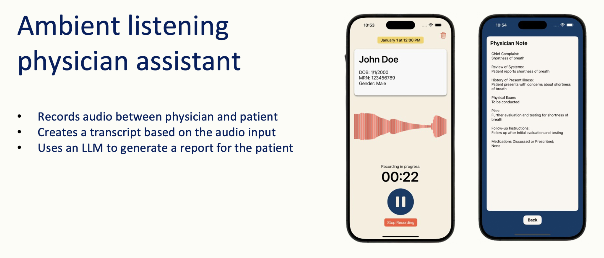

# Physician Assistant App

This physician assistant app is an iOS application that leverages large language models to summarize audio from patient-physician interactions and generate concise visit summaries with key recommendations.

## Overview

This project was built to help streamline medical documentation and improve communication between healthcare providers and patients. The app automatically transcribes recorded conversations, extracts important medical details, and produces an easy-to-read summary.

## Features

* **Speech-to-Text:** Converts spoken conversations into accurate text.
* **LLM Summarization:** Generates structured summaries and recommendations.
* **Privacy-Safe Processing:** Uses a secure HIPAA-protected LLM in the backend for NLP tasks.
* **Cross-Accent Support:** Handles diverse speech patterns and medical terminology.
